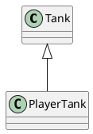
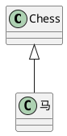

# <center>TypeScript</center>

[toc]

TypeScript是JS的超集，是一个可选、静态的类型系统

- 超集
- 类型系统
  对代码中所有的标识符（变量、函数、参数、返回值）进行类型检查
- 可选的
- 静态的(在运行前)
  无论浏览器还是node环境，无法直接识别ts代码
  >babel: es6 -> es5
  >tsc: ts -> es
  
tsc:ts编译器

静态：类型检查发生的时间，在编译时而非运行时

TS不参与任何运行时的类型检查。

## TS常识

- 2012年微软发布
- 开源、拥抱ES标准

中文网：www.tslang.cn

## 在node环境中搭建TS开发环境

### 安装TypeScript

> npm i -g typescript

默认情况下，TS会做出下面几种假设：

1. 假设当前的执行环境为DOM
2. 如果代码中没有使用模块化语句（import、export），便认为该代码是全局执行
3. 编译的目标代码是ES3

有两种更改假设的方式：

1. 使用tsc命令行的时候，加上选项参数
2. 使用ts配置文件，更改编译选项

## TS的配置文件

使用配置文件后，使用`tsc`进行编译时，不能跟文件名，否则会忽略配置文件
>tsc --init

tsconfig.json

```json
{
    "compilerOptions":{ //编译选项
        "target":"es2016", //配置编译目标代码的版本标准，es7 (Node环境支持到es7)
        "module":"commonjs",//配置编译目标使用的模块化标准 [commonjs|es6]
        "lib":["es2016"],//运行环境
        "outDir":"./dist",//输出目录
    },
    "include":["./src"],//编译某个文件夹中所有文件
    // "files":["./src/index.ts"],//仅编译某个文件
}
```

`@types/node`
@types是一个ts官方的类型库，其中包含了很多对js代码的类型描述。

## 使用第三方库简化编译流程

**ts-node:** 将ts代码在内存中编译，同时完成运行
**nodemon:** 用于检测文件的变化 `nodemon --watch src -e ts --exec ts-node src/index.ts` `-e ts`是配置只检测文件扩展名为ts的文件,`--watch src` 只监听src文件夹

## 基本类型约束

> TS是一个可选的静态类型系统

### 如何进行类型约束

变量、函数的参数、函数的返回值后加上`:类型`
ts在很多场景中可以完成类型推导

any:表示任意类型，对该类型，ts不进行类型检查

### 源代码和编译结果的差异

### 基本类型

-number
-string
-boolean
-数组  `let num:number[]=12;  let num:Array<number>=12;`
-object
-null和undefined

null和undefined是所有其他类型的子类型，他们可以赋值给其他类型

通过添加`strictNullChecks:true`，可以获得更严格的空类型检查，null和undefined只能赋值给自身。

### 其他常用类型

- 联合类型：多种类型任选其一（配合类型保护进行判断）
    类型保护：当对某个变量进行类型判断后，在判断语句块中便可以确定其确切类型，`typeof`可以触发

- void类型：通常用于约束函数的返回值，表示该函数没有任何返回值

- never类型：通常用于约束函数的返回值，表示该函数永远不可能结束

- 字面量类型：使用一个值进行约束 `let gender:'男'|'女';`

- 元组类型（Tuple）：一个固定长度的数组，并且数组中的每一项的类型确定 `let tup:[string,number];`

- any类型：any类型可以绕过类型检查，因此，any类型的数据可以赋值给任意类型

### 类型别名

对已知的一些类型定义名称

```ts
type 类型 = ...

```

### 函数的相关约束

函数重载：在函数实现之前，对函数调用的多种情况进行声明

可选参数：可以在某些参数名后加上问号，表示该参数可以不用传递。可选参数必须在参数列表的末尾。

```ts
/**
 * 第一种情况注释
 * */
function combine(a:number,b:number):number;
/**
 * 第二种情况注释
*/
function combine(a:string,b:string):string;
function combine(a:number|string,b:number|string):number|string{
    if(typeof a==='number' && b ==='number'){
        return a*b;
    }else if(typeof a === 'string' && typeof b === 'string'){
        return a+b;
    }
}
```

## 扩展类型-枚举

>扩展类型：类型别名、枚举、接口、类

枚举通常用于约束某个变量的取值范围

字面量和联合类型配合使用，也能达到同样的目标。

### 字面量类型的问题

- 在类型约束的位置，会产生重复代码。（可以使用类型别名解决该问题）
- 逻辑含义和真实的值产生了混淆，会导致当修改真实值的时候，产生大量的修改。
- 字面量类型不会进入到编译结果。

### 枚举

如果定义一个枚举：

```ts
enum 枚举名{
    枚举字段1=值1,
    枚举字段2=值2
}
```

枚举会出现在编译结果中，编译结果中表现为对象。

枚举规则：

- 枚举的字段值可以是字符串或数字
- 数字枚举的值会自动自增
- 被数字枚举约束的变量，可以直接赋值为数字
- 数字枚举的编译结果和字符串枚举有差异

最佳实践：

- 尽量不要在一个枚举中既出现字符串字段又出现数字字段
- 使用枚举时，尽量使用枚举字段的名称，而不使用真实的值

### 扩展知识：位枚举（枚举的位运算）

针对的数字枚举

位运算：两个数字换算成二进制后进行的运算

```ts
enum Permission {
    Read = 1,   //2^0  0001
    Write = 2,  //2^1  0010
    Create = 4, //2^2  0100
    Delete = 8  //2^3  1000
}

//1. 如何组合权限
//0001
//或
//0010
//0011
let p:Permission = Permission.Read | Premission.Write;

//2. 如何判断是否拥有某个权限
//0011
//与
//0010
//0010
function hasPermission(target:Permission,per:Permission){
    return (target & per) === per;
}
//判断变量p是否拥有可读权限
hasPermission(p,Permission.Read);

//3. 如何删除某个权限
//0011
//异或
//0010
//0001
p = p ^ Permission.Write;

```

## 模块化

|      配置名称       |              含义              |
| :-----------------: | :----------------------------: |
|       module        | 设置编译结果中使用的模块化标准 |
|  moduleResolution   |       设置解析模块的模式       |
| noImplicitUseStrict |  编译结果中不包含"use strict"  |
|   removeComments    |        编译结果移除注释        |
|    noEmitOnError    |      错误时不生成编译结果      |
|   esModuleInterop   |   启用es模块交互非es模块导出   |

>前端领域中的模块化标准：**ES6**、**commonjs**、amd、umd、system、esnext

TS中如何书写模块化语句？
编译结果使用的什么模块化标准？

### TS中如何书写模块化语句

TS中，导入和导出模块，统一使用ES6的模块化标准

### 编译结果中的模块化

可配置

TS的模块化在编译结果中：

- 如果编译结果的模块化标准是ES6，没有区别
- 如果编译结果的模块化标准是commonjs，导出声明会变成exports的属性，默认的导出会变成exports的default属性

```ts
import fs from "fs";  //会报错，fs模块不是默认导出，是module.exports={}形式，解决方式如下
import * as fs from "fs";

//如果一定要使用，只需要在配置文件中加上"esModuleInterop"=true

```

### 如何在TS中书写commonjs模块化代码

不建议使用，建议使用ES6语法

实在是需要时，可以如下使用

```ts
//导出
export={};//要使用该语法

module.exports={};//不使用

//导入
import fs= require('fs');//使用该语法

const fs = require('fs');//不使用

```

### 模块解析

模块解析：应该从什么位置寻找模块

TS中，有两种模块解析策略

- classic：经典（过时）
- node：node解析策略（唯一的变化，是将js替换成ts）
  - 相对路径`require('./xxxx')`
  - 非相对路径`require('xxxxx')`

***`rd /d /q [delDir]`*** windows下删除文件夹命令

## 接口和类型兼容性

### 扩展类型-接口

TS的接口：用于约束类、对象、函数的契约（标准）
契约（标准）的形式：

- API文档，弱标准
- 代码标准，强标准

和类型别名一样，接口不出现在编译结果中

#### 1. 接口约束对象

```ts
interface User{
    name:string
    age:number
}
```

#### 2. 接口约束函数

```ts
interface User{
    name:string
    age:number
    sayHello:()=>void
    sayHaha():void
}


// type Con=(n:number)=>boolean

interface Con { //没有其他成员，为定界符
    (n:number):boolean
}

function sum(numbers:number[],callBack:Con){
    let s=0;
    numbers.forEach(n=>{
        if(callBack(n)){
            s+=n;
        }
    });
    return s;
}
```

***接口可以继承***
可以通过接口之间的继承，实现多种接口的组合

使用类型别名可以实现
类似的组合效果，需要通过`&`**交叉类型符号连接
它们的区别：

- 子接口不能覆盖父接口的成员
- 类型别名会将两个相同成员的类型进行交叉 （number & string）

```ts
interface A{
    T1:number
}

interface B{
    T2:number
}

interface C extends A, B{
    T3:string
}


type A{
    T1:number
}

type B{
    T2:number
}

type C{
    T3:string
} & A & B

```

### readyonly

只读修饰符

不在编译结果中

```ts
interface User{
    readyonly  id:string
    name:string
    age:number
    readonly arr: readonly number[]
}

let u:User={
    id:'dsakfl',  //只能第一次赋值
    name:'dslakflsdfksdlf',
    age:24
}

u.id='dskfls'; //重新赋值报错


// 注意
let arr:readonly number[] = [1,23,6,3];
let arr: ReadonlyArray<number> = [1,23,6,3];
//表示的含义是数组为不能修改的数组，修饰变量arr，
//所有改变数组的方法都不能使用（不提示），但是arr可以重新赋值
```

## 类型兼容性

B->A,如果能完成赋值，则B和A类型兼容

鸭子辨型法（子结构辨型法）：目标类型需要某一些特征，赋值的类型只要能满足该特征即可

- 基本类型：完全匹配
- 对象类型：鸭子辨型法

类型断言 （赋值后面加上 `as 类型`或者在赋值前面加上`<类型>`即可）
当直接使用对象字面量赋值时，会进行跟家严格的判断

```ts
interface Duck{
    sound:'嘎嘎嘎'
    swim():void
}

let person={
    name:'dlksafjdslf',
    age:12,
    sound:'嘎嘎嘎' as '嘎嘎嘎',
    swim(){
        console.log('swim');
    }
}

```

- 函数类型
  1. 参数：传递给目标函数的参数可以少，但不可以多
  2. 返回值：要求返回必须返回，不要求返回的随意

## TS的类

>面向对象思想

### 属性

使用属性列表来描述类中的属性

**属性的初始化检查:** 防止漏写属性赋值，使用配置`"strictPropertyInitialization":true`
属性的的初始化位置：

1. 构造函数中
2. 属性默认值

***属性可以修饰为可选的***

***属性可以修饰为只读的***

***使用访问修饰符*** (js解决这个问题使用Symbol)
访问修饰符可以控制类中的某个成员的访问权限

- public
- private
- protected

***属性简写***

如果某个属性，通过构造函数的参数传递，并且不作任何处理的赋值给该属性。可以简写

```ts
class User{
    readonly id: number
    // name:string   //参数前面加上public后，相当于声明+赋值，可简写
    age:number
    gender:"男"|"女" = "男"  //完成默认初始化
    pid?: string
    private curNumber: number = 30;

    constructor(public name:string,age:number){
        this.id = Math.random();
        this.name = name;  //参数前面加上public后，相当于声明+赋值，可简写
        this.age = age;
    }
}

```

### 访问器

作用：用于控制属性的读取和赋值

```ts
class User{
    private _age:number

    set age(val:number){ //ES6自带访问器属性，不是ts新增
        this._age = val;
    }
    get age(){
        return this._age;
    }
}
```

## 泛型

有时，书写某个函数时，会丢失一些类型信息（多个位置的类型应该保持一致或有关联的信息）

泛型：是指附属于函数、类、接口、类型别名之上的类型
泛型相当于是一个类型变量，在定义函数时，无法预先知道具体的类型，可以用该变量来代替，只用到调用时，才能确定它的类型

很多时候，TS会智能的根据传递的参数，推导出泛型的具体类型
如果无法完成推到，并且又没有传递具体类型，默认为空对象

泛型可以设置默认值`<T = number>`

### 在函数中使用泛型

在函数名之后写上`<泛型名称>`

### 在类型别名、类、接口中使用泛型

直接在名称写上`<泛型名称>`

### 泛型约束

用于限制泛型类型值

`<T extends 接口名称>`

### 多泛型

`<T1,T2>`

***练习字典类（见视频）***

## 深入理解类的接口

### 面向对象概述

1. TS为前端面向对象开发带来契机
   JS语言没有类型检查，如果使用面向对象的方式开发，会产生大量的接口，而大量的接口会导致调用复杂度剧增，这种复杂度必须通过严格的类型检查来避免错误，尽管可以使用注释或文档或记忆力，但是它们没有强约束力。
   TS带来了完整的类型系统，因此开发复杂程序时，无论接口数量多少，都可以获得完整的类型检查，并且这种检查是具有强约束力。
2. 面向对象中有许多非常成熟的模式，能处理复杂问题
   nextjs:相当于是前端的java spring
   typeorm:ORM框架，比如：mongoose,类似C#、EF

### 什么是面向对象

面向对象：Oriented Object,(简称OO)

> 是一种编程思想，它提出一切以对象对切入点思考问题。

其他编程思想：面向过程，函数式编程

>学开发最重要最难的是什么？ 思维

面向过程：以功能流程为思考切入点，不太适合大型应用

函数式编程：以数学运算为思考切入点

面向对象编程：以划分类为思考切入点。类是最小的功能单元

类：可以产生对象的模板

### 类的继承

继承的作用

继承可以描述类与类之间的关系

如果A和B都是类，并且可以描述为A是B，则A和B形成继承关系：

- B是父类，A是子类
- B派生A，A继承自B
- B是A的基类，A是B的派生类

如果A继承自B，则A拥有B所有的成员



### 成员重写

重写（override）子类中覆盖父类成员

子类成员不能改变父类成员的类型

无论是属性还是方法，子类都可以对父类的相应成员进行重写，但是重写时，需要保证类型的匹配

注意this关键字，在继承关系中，this的指向是动态的——调用方法时，根据具体的调用者确定this指向

super关键字：在子类的方法中，可以使用super关键字读取父类成员

### 类型匹配

鸭子辨型法

子类对象，始终可以赋值给父类  ->  里氏替换原则

如果需要判断一个数据的具体子类类型，可以使用`instanceof`

### protected

只能在自身或子类中访问

### 单根性和传递性

单根性：每个类只能拥有一个父类

传递性：如果A是B的父类，并且B是C的父类，则可认为A也是C的父类

### 抽象类



有时，某个类只表示一个抽象概念，主要用于提取子类共有的成员，而不能直接创建它的对象。该类可以作为抽象类。

给类前面加上`abstract`，表示该类是一个抽象类，不可以创建一个抽象类的对象。

### 抽象成员

父类中，可能知道有些成员是必须存在的，但是不知道该成员的或类型是什么，因此，需要有一种强约束让继承该类的子类。

抽象类中，可以有抽象成员，这些抽象成员必须在子类中实现

```ts
abstract class Chess {
    x:number = 0;
    y:number = 0;
    abstract readonly name:string;
}

```

### 设计模式 - 模板模式

有些方法中，所有的子类实现的流程完全一致，只是流程中的某个步骤的具体实现不一样，可以将该方法提取到父类，在父类中完成整个流程的实现，遇到实现不一致的方法时，将该方法左乘抽象方法

## 静态成员

附着在类上的成员（属于摸个构造函数的成员）

使用`static`修饰的成员是静态成员

实例成员：对象成员，属于某个类的对象

静态成员：非实例成员，属于某个类

静态方法中的`this`指向**当前类**

### 设计模式 —— 单例模式

## 再谈接口 (见视频例子)

不使用接口：

- 对能力（成员函数）没有强约束力
- 容易将类型和能力耦合在一起

面向对象领域中的接口语义：表达了某个类是否拥有某种能力

某种类具有某种能力，其实就是实现了某种接口

`class Lion extends Animal implements IFireShow`

***类型保护函数***：通过调用该函数，会触发TS的类型保护，该函数必须返回boolean

接口和类型别名的最大区别：接口可以被类实现，而类型别名不可以

```ts
function hasFireShow(ani:object): ani is IFireShow{
    if((ani as IFireShow).singleFire && (ani as IFireShow).doubleFire){
        returen true;
    }
    return false;
}
```

> 接口可以继承类：表示该类的所有成员都在接口中。 `interface C extends A,B`

## 索引器

`对象[值]`,成员表达式

在TS中，默认情况下，不对索引器（成员表达式）做严格类型检查

使用配置`"noImplictAny":true`开启隐式any的检查

隐式any类型：TS根据实际情况推导出的any类型

`[prop:string]:any`,在类中，索引器书写位置应该是所有成员之前

索引器中，键的类型可以是字符串，也可以是数字

TS中索引器的作用：

- 在严格的检查下，可以实现为类动态增加成员
- 可以实现动态的操作类成员

在JS中，所有的成员名本质上，都是字符串，如果使用数字作为成员名，会自动转换为字符串。

在TS中，如果某个类中使用了两种类型的索引器，要求两种索引器的值类型必须匹配，如果不一样，则`[prop:number]`的值类型必须为`[prop:string]`的值类型的子类型

```ts
class A{
    [prop:number]:string;
    [prop:string]:string;
}

const a = new A();
a[0] = 'dsklfsdl';
a['pid'] = 'sdajfksdfkfdgj';
```

## this指向约束

<https://yehudakatz.com/2011/08/10/understanding-javascript-invocation-and-this/>

### 在JS中this指向的几种情况

大部分时候，this的指向取决于函数的调用方式

- 如果直接调用函数（全局调用），this指向全局对象或undefined（严格模式）
- 如果使用`对象.方法`调用，this指向对象本身
- 如果是dom事件的处理函数，this指向事件处理对象

特殊情况：

- 箭头函数
- 使用bind、call、apply手动绑定this对象

## TS中的this

配置`"noImplicitThis":true`,表示不允许this隐式的指向any

在TS中，允许在书写函数时，手动声明该函数中this的指向，将this作为函数的第一个参数约定this指向，该参数只用约束this，并不是真正的参数，也不会出现在编译结果中。

```ts
interface IUser{
    name:string;
    age:number;
    sayHello(this:IUser):void; //声明this指向，获取更严格的类型检查，不会作为参数进入编译
}
```

## 装饰器

>面向对象概念（java:注释，c#:特征），decorator
>angular大量使用，react中也会使用
>目前JS支持装饰器，目前处理建议征集的第二阶段

### 解决的问题

装饰器：能够带来额外的信息量，可以达到分离关注点的目的。

- 关注点的问题：在定义某个东西时，应该最清楚该东西的情况（信息书写位置问题）
- 重复代码问题

产生的根源：某些信息在定义时，能够附加的信息量有限。

装饰器作用：为某些数据（属性、类、参数、方法）提供原数据信息

```ts
class User{
    @require   //验证规则
    @range(3,5)
    @description('账号')
    loginID:string;
}
```

### 装饰器的本质

在JS中，装饰器是一个函数（装饰器要参与运行的）

装饰器可以修饰

- 类
- 成员（属性+方法）
- 参数

### 类装饰器

装饰器本质是一个函数，该函数接受一个参数，表示类本身（构造函数本身）

使用装饰器`@函数`

```ts
function test(target:new(...args:any[])=>object){

}

@test
class A{

}
```

在TS中，如何约束一个变量为类

- Function
- `new(...args:any[])=>object`

在TS中使用装饰器，需要开启`experimentalDecorators`

装饰器函数运行时间：在类定义之后直接运行

装饰器可以具有的返回值

- void 仅运行函数
- 返回一个新的类，会将新的类替换装饰目标

```ts
function test(str:string){
    return function(target:new(...args:any[]){

    })
}

@test('这是一个类')
class A{

}
```

多个装饰器：从下到上依次运行，后加入先运行

```ts
type constructor = new(...args[])=>object
function d1(){
    return function(target:constructor){

    }
}

function d1(){
    return function(target:constructor){

    }
}

@d2()
@d1()
class A{
    p1:string
}
```

### 成员装饰器

- 属性
  属性装饰器也是一个函数，该函数需要两个参数：
  1. 如果是静态属性，则为类本身；如果是实例属性，则为类的原型；
  2. 固定为一个字符串，表示属性名

- 方法
  方法装饰器也是一个函数，该函数需要三个参数：
  1. 如果是静态属性，则为类本身；如果是实例属性，则为类的原型；
  2. 固定为一个字符串，表示方法名
  3. 描述符对象

可以有多个装饰器修饰

### 练习：类和属性的描述装饰器

### reflect-metadata库

保存原数据

### class-validator和class-transformer库

### 补充

- 参数装饰器

依赖注入，依赖倒置

要求函数有三个参数：

   1. 如果方法是静态的，则为类本身；如果方法是实例方法，则为类的原型
   2. 方法名称
   3. 在参数列表中的索引

```ts
class Math{
    sum(a:number,@test b:number){
        return a + b;
    }
}

function test(target:any, method:string, index:number){
    console.log(target, method, index);
}
```

- 关于TS自动注入的元数据

如果安装了`reflect-metadata`库，并且导入了该库，并且在某个成员上添加了元数据，并且启用了`"emitDecoratorMetadata":true`，则TS在编译结果中，会将约束的类型，作为元数据加入到相应位置
这样一来，TS的类型检查（约束）有机会在运行时进行。

- AOP （aspect oriented programming）

一种编程方式，属于面向对象开发。

将一些业务中出现的功能块横向切分，以达到分离关注点的目的。

## 类型演算

根据已知信息，计算出新的类型

### 三个关键字

- typeof

TS中的typeof，书写的位置在类型约束的位置上

表示获取某个数据的类型

当typeof作用于类的时候，得到的类型，是该类的构造函数

```ts
let a:string = 'adlksd';
let b:typeof a ;  //让b的类型与a的类型保持一致
```

- keyof

作用于类、接口、类型别名，用于获取其他类型中的所用成员名组成的联合类型

```ts
interface User{
    loginid:string;
    loginpwd:string;
    age:number;
}

function printUserProperty(obj:User,prop:keyof User){
    console.log(obj[prop]);
}
```

- in

该关键字往往和keyof联用，限制某个索引类型的取值范围

```ts
interface User{
    loginid:string;
    loginpwd:string;
    age:number;
}

//将User的所有属性值类型变成字符串，得到一个新类型
typeof UserString<T>={
    [p in keyof T]:T[p];
}

const u:UserString={
    loginid:'fgjfsl',
}
```

### TS中预设的类型演算

```ts
Partial<T> //将类型T中的成员变成可选

Required<T>  //将类型T中的成员变成必填

Readonly<T>  //将类型T中的成员变成只读

Exclude<T,U>  //从T中剔除可以赋值给U的类型

Extract<T,U>  //提取T中可以赋值给U的类型

NonNullable<T>  //从T中剔除null和undefined

ReturnType<T>  //获取函数返回值类型

InstanceType<T>  //获取构造函数类型的实例
```

## 声明文件

### 概述

1. 什么是声明文件
   以`.d.ts`结尾的文件
2. 声明文件有什么用?
   为JS代码提供类型声明
3. 声明文件位置
   - 放置到tsconfig.json配置中包含的的目录中
   - 放置到node_modules/@types文件夹中
   - 手动配置`"typeRoots":["./types"]`
   - 与JS代码所在的目录相同，并且文件名也相同的文件。用ts代码书写的工程发布之后的格式。

### 编写

- 自动生成

工程是使用ts开发的，发布（编译）之后，是js文件，发布的是js文件。

如果发布的文件需要其他开发者使用，可以使用声明文件，来描述发布结果中的类型。

配置tsconfig.json中`"declaration":true`

- 手动编写

1. 对已有库，它是使用js书写而成，并且更改该库的代码成本高，可以手动编写声明文件
2. 对一些第三方库，它们使用js书写而成，并且这些第三方库没有提供声明文件

***全局声明***

声明一些全局的对象、属性、变量

> namespace:表示命名空间，可以将其认为是一个对象，命名空间中的内容，必须通过`命名空间.成员名`访问

```ts
//.d.ts

declare var console:{
    log(message?:any):void
}

declare namespace console{
    function log(message?:any):void
}
```

***模块声明***

```ts
//声明模块
declare module "lodash" {
    export function chunk<T>(array:T[],size:number):T[][];
}
```

***三斜线指令***

在一个声明文件中包含另一个声明文件

```ts
/// <reference path="../../index.d.ts" />
```

### 发布

1. 当前工程使用ts开发
   编译完成后，将编译结果所在文件夹直接发布到npm上即可
2. 为其他第三方库开发的声明文件
   发布到@types/**中

   1) 进入GitHub的开源项目：<https://github.com/DefinitelyTyped/DefinitelyTyped>
   2) fork到自己的开源库中
   3) 从自己的开源库中克隆到本地
   4) 本地新建分支，在新分支中进行声明文件的开发，在types目录下新建文件夹，在新的文件夹中开发声明文件
   5) push分支到自己的开源库
   6) 到官方的开源库中，提交pull request
   7) 等待官方管理员审核（1天）
   8) 审核通过后，会将你的分支代码合并到主分支，然后发布到npm，之后，就可以通过命名安装
